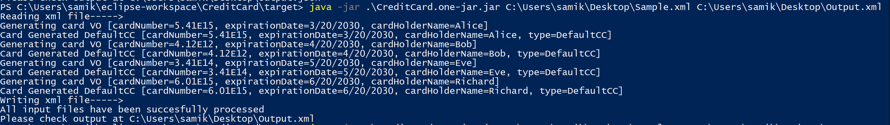

# individual-project-samiksjsu
individual-project-samiksjsu created by GitHub Classroom

# CREDIT CARD DESIGN

#### 1. The Project is a Maven Project. If you pull the project into your local via git pull <path\> master you can either import it as a maven project in your IDE or else execute everything from command line. Please install the dependecies via  mvn install.(If you dont have maven, [install here](https://maven.apache.org/install.html) )
#### 2. After mvn clean install , please do mvn package to generate a executeable JAR, it will be available in the /targets folder. Note that run these commands in the folder where pom.xml file is present else it will give an error.
#### 3. You can Skip all this and use the CardDesign.one-jar.jar JAR from the CardDesign/JAR folder in the repository.
#### 4. You can run the jar by using following command => java -jar CreditCard.one-jar.jar <InputFilePath\> <OutputFilePath\> (Please use fully Qualified Paths for Input and Output).
eg:- java -jar .\CreditCard.one-jar.jar C:\Users\samik\Desktop\Sample.csv C:\Users\samik\Desktop\Output.csv (Note - this is for windows machine. Please provide appropriate fully qualified paths for MACOS)
#### 5. The File paths Should be specified or else you will get Error: Not all arguments present error message on the console. If the file path is incorrect you will get an error message on the console.

# Notes 

#### 1. If you don't provide proper CardNumbers like the one provided in the Sample Input Files, it will result in an InvalidCardNumber error, in the Output Files.
#### 2. Possible exceptions are Handled Properly and you will see a Custom error message in the Output Terminal if something goes wrong.
#### 3. One important thing to Note is that, some fields in the Sample Output are in Quotations marks, some aren't, for consistency each writer will write every field enclosed in Quotations.
#### 4. In some input files,full date is provided like 3/12/2020 and in some 3/12/20 for consistency and considering the actual card please provide date in this format only MM/dd/yy or MM/dd/YYYY. 
#### 5. As per the requirements specified in the project documents, the input and output file must have same extensions and have a valid file paths, or else the program will specify appropriate message and won't proceed further.
#### 6. Main program logic is present in src/main/java and test logic is present in src/test/java
#### 7. Comprehensive test cases are written and can be found in src/test/java

# Sample Run

